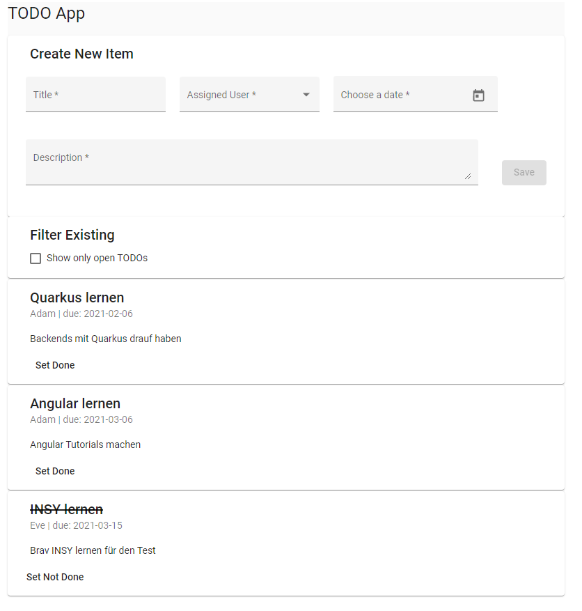
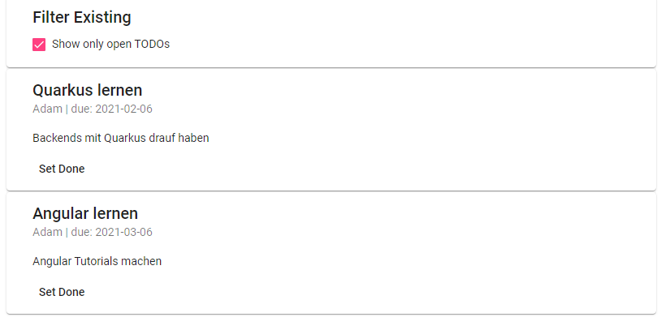
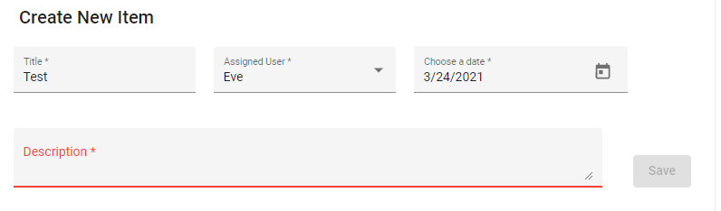
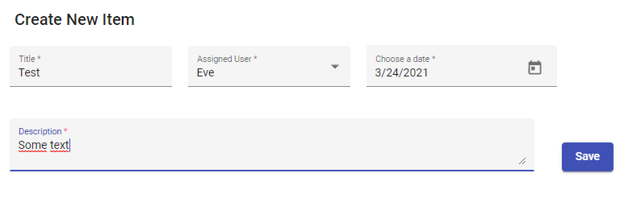

:icons: font

= TODO List

In this exercise you will create the client side of a simple TODO list.
I know this example is very common, and you probably did it five times already, but that is exactly the point: you know very well what to expect.
So you can compare typical programming paradigms for this platform with those you already know.

== Server
You have been provided with a sample implementation of a backend server.
This implementation is already complete and sufficient to solve the exercise (developing the client).

=== How to run the server
Within the `server` directory execute the following commands:

[source,bash]
----
npm i // <1>
npm run build // <2>
npm run start // <3>
----
<1> Install Packages
<2> Compile
<3> Run -- do not close the terminal!

Then navigate to http://localhost:8080/api/people[http://localhost:8080/api/people] to check that the server is running properly.
The output should look like this:

[source,json]
----
[{"name":"Adam"},{"name":"Eve"}]
----

A `demo.http` file has also been provided to allow you testing the API of the server.
Mind the `http-client.env.json` file configuring the host variable -- WebStorm should recognize it and allow you to run queries in the 'dev' environment.

=== A real server

If you decide to train your skills you can earn bonus credit by creating an actual Quarkus+JPA application, backed by a real database, to serve as backend of the client you are developing in this exercise.

== Client

A basic Angular project has already been provided.
Extend it to support the following features:

. Creating a new TODO item
** An item consists of the following properties:
*** ID -- assigned by the service
*** Title
*** Assigned User
**** The users are hard-coded in the server, you may extend/change that list if you want to
*** Due Date
*** Done -- flag if complete
*** Description
** All fields are required
*** Disable the create button until everything is filled in
** Retrieve the users from the server and provide them in a dropdown
** Use a datepicker for the due date
** `POST` the new item to the service
. Listing existing items
** Retrieve the existing items from the service
** If a new item is added you have two options:
*** Modify the collection locally or
*** Reload from the service (a little simpler and fine for this assignment)
** Sort the items by due date
. Marking existing items as done
** Allow flagging existing items as complete
** Also 'persist' this change by `PATCH`ing the data on the server
. Filter for not yet completed items
** Provide a checkbox, or a toggle switch, to show only still open (= not done) items
*** Updating items also affects the filtered list

Your client should look like this (better design is allowed 😉):

=== More impressions

* Filtered list +

* Validation Error +

* Ready to create new item +

=== Angular Material

Consider using Angular Material.

Hints:

* `ng add @angular/material`
* https://material.angular.io/guide/getting-started[Getting Started]

=== Additional Modules

You might find some use for these modules:

* `HttpClientModule`
* `FormsModule`
* `ReactiveFormsModule`

Also: a datepicker might need a provider and not just an import.

=== Requirements

* Make sure your implementation is correct (duh)
** You do not _need_ to write tests this time, but of course you are allowed to if you want
* Ensure that the linter is happy as well
* Commit often -- submissions with less than three commits will *not be graded*!
** Also include your last name at the beginning of every commit message
* Design of the website is not too important
** But do _not_ perform manual DOM manipulation -- bindings only!